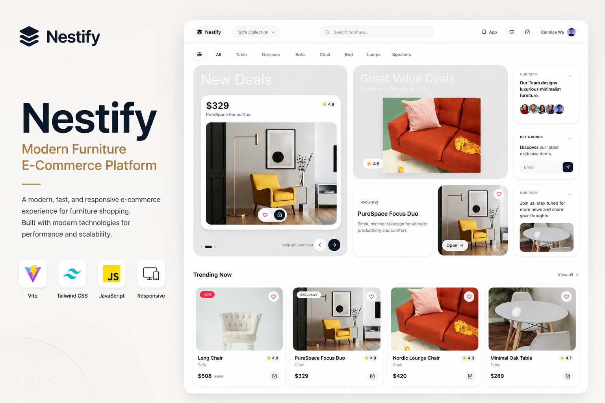
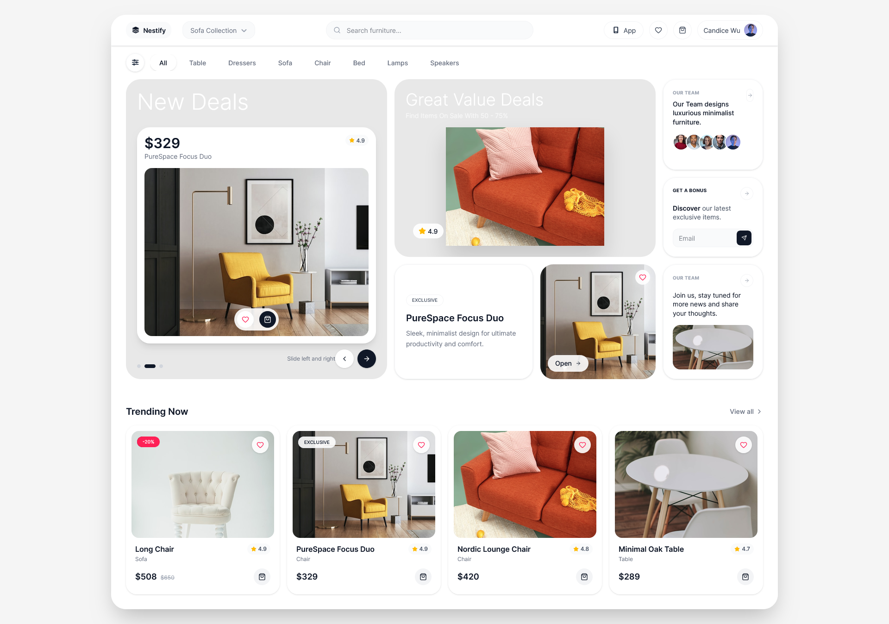
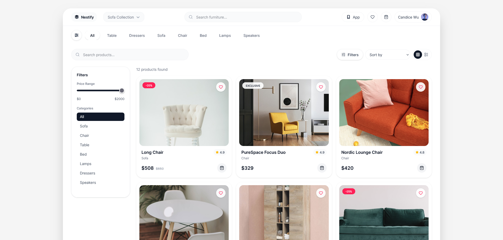
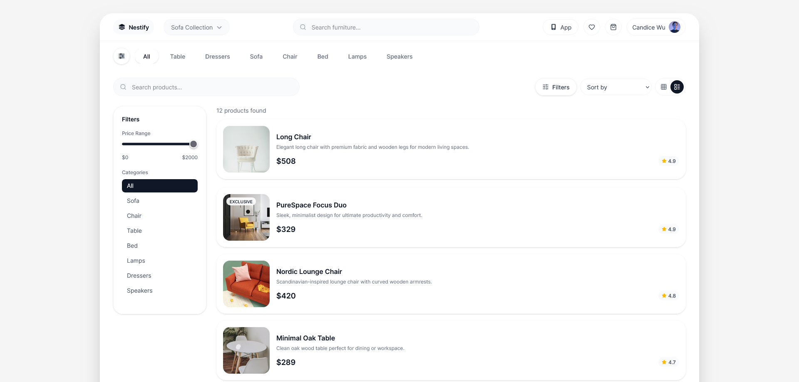
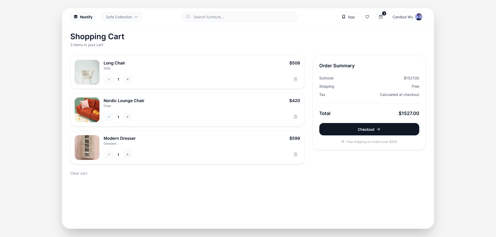
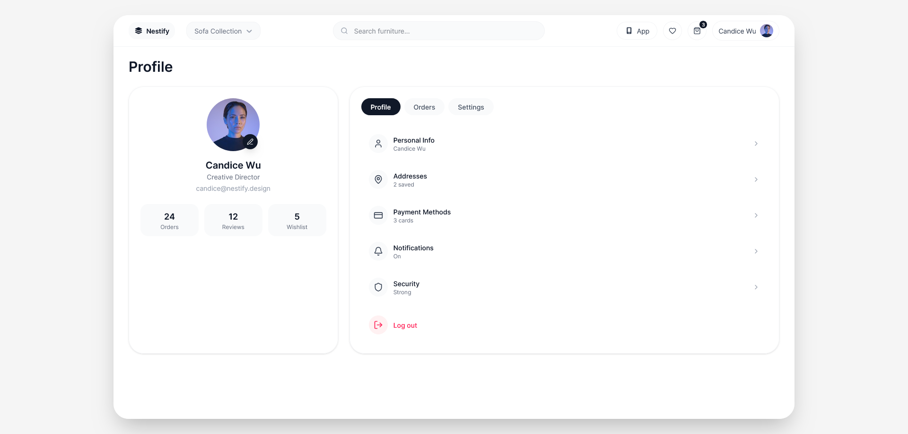

# Nestify

Modern Full-Stack E-Commerce Platform

## Overview

Nestify is a modern full-stack eCommerce platform designed to deliver a fast, scalable, and seamless online shopping experience.

The platform provides a complete shopping workflow including product discovery, user authentication, cart management, secure checkout, order processing, and administrative management tools.

Built with scalability and maintainability in mind, Nestify follows modern web development practices and responsive design principles to provide an optimized experience across desktop, tablet, and mobile devices.

---

## Live Demo

Demo Website:

https://nestify.paarlastudio.com

---

## Key Features

### Customer Features

* User Registration & Authentication
* Product Catalog
* Product Search
* Category Filtering
* Product Detail Pages
* Shopping Cart
* Wishlist System
* Checkout Workflow
* Order History
* User Dashboard
* Responsive Design

### Administrative Features

* Product Management
* Category Management
* Order Management
* Customer Management
* Inventory Monitoring
* Dashboard Analytics

### Technical Features

* RESTful Architecture
* Secure Authentication
* Responsive UI
* Optimized Performance
* Scalable Database Structure
* SEO Friendly Structure

---

## Technology Stack

Frontend

* HTML5
* CSS3
* JavaScript
* Bootstrap

Backend

* Django
* Python

Database

* PostgreSQL / SQLite

Deployment

* Linux Server
* Apache
* Gunicorn

---

## Screenshots

### Homepage

### Product Page

### Shopping Cart

### Admin Dashboard

---

## Project Architecture

Nestify follows a modular architecture separating business logic, presentation layers, and database interactions.

* Authentication Module
* Product Module
* Cart Module
* Checkout Module
* Order Module
* Administration Module

---

## Performance Goals

* Fast Page Rendering
* Mobile First Experience
* SEO Optimization
* Scalable Infrastructure

---

## Future Improvements

* Multi Vendor Support
* AI Product Recommendations
* Advanced Analytics
* Multi Language Support
* Payment Gateway Extensions
* Progressive Web App (PWA)

---

## Author

GitHub:
https://github.com/alirezahosseini

Portfolio:
https://elham.paarlastudio.com

---

## License

MIT License
